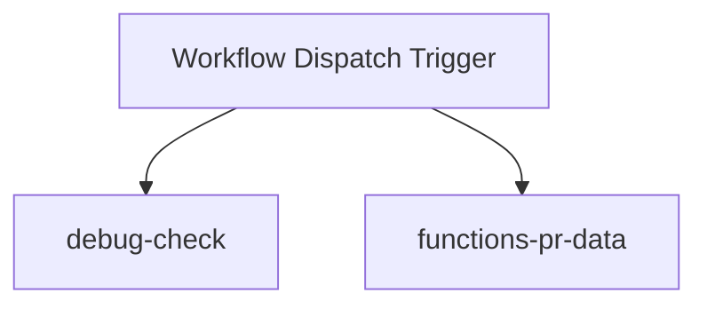
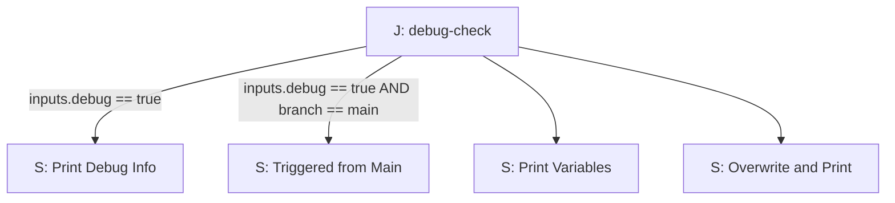
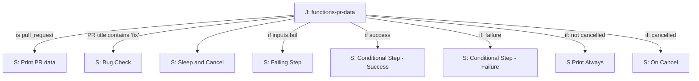

# Ejercicio: Flujos avanzados con GitHub Actions

## Objetivo

Consolidar conocimientos sobre expresiones, variables de entorno y funciones en GitHub Actions mediante la implementación de un flujo de trabajo práctico y multifuncional.

---

## Tareas

1. **Crear un archivo de flujo de trabajo** llamado `expressions.yaml` en la carpeta `.github/workflows` en la raíz del repositorio. El flujo debe cumplir con las siguientes características:
   
   * **Nombre:**  Expressions
   * **Desencadenantes:** 
    - `pull request`
    - `workflow_dispatch`. 
      - Agregar un parámetro de entrada llamado `debug` de tipo booleano con un valor predeterminado `false`.
      - Agregar un parámetro de entrada llamado `fail` de tipo booleano con un valor predeterminado `false`.
   * **Variables de entorno a nivel de workflow:**
     * `WORKFLOW_VAR`: `'This is a workflow-level variable'`.
     * `OVERWRITTEN`: `'Default workflow value'`.
2. **Definir los trabajos** dentro del flujo de trabajo:
   
   #### **Job: debug-check**
   
   * Ejecutarse en `ubuntu-latest`.
   * **Variables de entorno a nivel de job:**
     * `JOB_VAR`: `'This is a job-level variable'`.
     * `OVERWRITTEN`: `'Overwritten at job level'`.
   
   **Steps:**
   
   * **Step 1:** _"[Debug] Print Debug Info"_
     
     * Ejecutarse solo si la entrada `inputs.debug` es `true`.
     * Imprimir:
     
     ```bash
     "Triggered by: ${{ github.event_name }}" 
     "Branch: ${{ github.ref }}" 
     "Commit SHA: ${{ github.sha }}" 
     "Runner OS: ${{ runner.os }}"
     ```
   * **Step 2:** _"[Debug] Triggered from Main"_
     
     * Ejecutarse solo si `inputs.debug` es `true` y la rama es `main`.
     * Imprimir: `"Triggered from main branch!"`.
   * **Step 3:** _"Print Variables"_
     
     * Definir variables de entorno a nivel de step:
       * `STEP_VAR`: `'Step-level variable'`.
     * Imprimir las siguientes líneas:
     
     ```bash
     "Step var: ${{ env.STEP_VAR }}" 
     "Job var: ${{ env.JOB_VAR }}" 
     "Workflow var: ${{ env.WORKFLOW_VAR }}" 
     "Overwritten: ${{ env.OVERWRITTEN }}"
     ```
   * **Step 4:** _"Overwrite and Print"_
     
     * Sobrescribir `OVERWRITTEN` con el valor `'Overwritten at step level'` y confirmar el resultado:
     
     ```bash
     "Overwritten var: $OVERWRITTEN"
     ```
   
   #### **Job: functions-pr-data**
   
   * Ejecutarse en `ubuntu-latest`.
   * **Steps:**
     
     * **Step 1:** _"Print PR Info"_
       * Ejecutarse solo si el evento es `pull_request`.
       * Imprimir el título de la PR y las etiquetas de la PR en formato JSON utilizando `toJSON`.
     
     ```yaml
     steps:
       - name: Print PR labels
         run: |
           cat << EOF
           ${{ toJSON(github.event.pull_request.labels) }}
           EOF
     ```
     
     * **Step 2:** _"Bug Check"_
       
       * Ejecutarse solo si el flujo no ha sido cancelado y el título de la PR contiene `"fix"`.
       * Imprimir: `"This PR fixes a bug."`
     * **Step 3:** _"Sleep and Cancel"_
       * Ejecutar `sleep 20` para permitir la cancelación manual del workflow.
         
     * **Step 4:** _"Failing Step"_
       * Ejecutarse solo si la entrada `inputs.fail` es `true`.
       * Salir (comando exit) con un código distinto de cero.
         
     * **Step 5:** _"Conditional Step - Success"_       
       * Ejecutarse solo si los pasos anteriores tienen éxito.
       * Imprimir: `"All previous steps succeeded."`
         
     * **Step 6:** _"Conditional Step - Failure"_       
       * Ejecutarse si algún paso anterior falló.
       * Imprimir: `"A previous step failed."`
         
     * **Step 7:** _"Print Always"_       
       * Ejecutarse siempre que el flujo no sea cancelado.
       * Imprimir: `"This step runs unless the workflow is cancelled."`
         
     * **Step 8:** _"On Cancel"_       
       * Ejecutarse solo si el flujo ha sido cancelado.
       * Imprimir: `"Workflow cancelled."`
         
3. **Confirmar y probar** el flujo de trabajo:   
   * Ejecutar el flujo desde la interfaz de usuario con diferentes valores rama,  `debug` y `fail` Observando resultados.
   * Realizar pruebas con pull requests:
     1. Crear una nueva rama y modificar cualquier archivo, por ejemplo, `README.md`.
     2. Crear una **Pull Request** con un título que incluya la palabra `"fix"` (por ejemplo: `"Fix: typo in README"`), y una label bug.
     3. Observar los resultados del flujo de trabajo. Confirma que el step `"Bug Check"` imprime el mensaje `"This PR fixes a bug."`. y se imprimen labels en el step print PR info
     4. Cambiar el título de la PR para que no incluya `"fix"` y volver a inspeccionar los resultados.
   * Cancelar manualmente el flujo nada mas iniciarlo en la ejeción para observar los pasos específicos relacionados con la cancelación. Fijarse en el step On Cancel

---

## Tips

#### **Condiciones en jobs y steps**

* Para ejecutar jobs y steps de manera condicional, usa la palabra clave `if`. Por ejemplo:
  
  ```yaml
  jobs:
    example:
      runs-on: ubuntu-latest
      steps:
        - name: Run if triggered by push
          if: github.event_name == 'push'
          run: echo "Triggered by a push event"
  ```
* Para verificar el estado de pasos previos, usa funciones como `success()` o `failure()`.
  
  * `success()`: Se evalúa como verdadero si todos los pasos anteriores se completaron correctamente.
  * `failure()`: Se evalúa como verdadero si alguno de los pasos anteriores falló.

#### **Definición de variables de entorno**

* Variables de entorno pueden definirse a nivel de:
  
  * **Workflow:**
    
    ```yaml
    env:
      WORKFLOW_VAR: 'Hello from workflow'
    ```
  * **Job:**
    
    ```yaml
    jobs:
      example:
        env:
          JOB_VAR: 'Hello from job'
    ```
  * **Step:**
    
    ```yaml
    steps:
      - name: Define env vars
        env:
          STEP_VAR: 'Hello from step'
    ```
* Acceso a variables:
  
  * Con el contexto `env`: `${{ env.VAR_NAME }}`
  * Directamente en shell: `$VAR_NAME`

#### **Uso de expresiones**

* Usa operadores condicionales para simplificar configuraciones:
  * Valor por defecto: `${{ expresión || valor_predeterminado }}`
  * Condicional tipo ternario: `${{ condición && valor_si_true || valor_si_false }}` (Similar a condicion "condicion?valortrue:valorfalse) de java)

---

## Diagrama de flujo

Jobs:



Steps for debug-check



Steps for functions-pr-data



